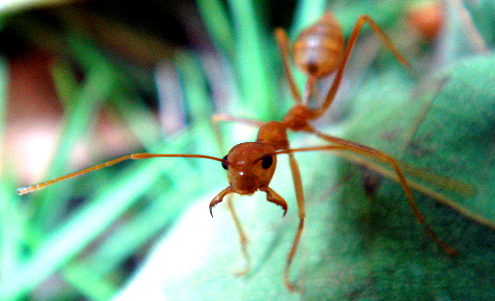

## Pairwise Sequentially Markovian Coalescent Model

<a href="//bmpvieira.com/labjolly2014a" target="_blank">bmpvieira.com/labjolly2014a</a>


Bruno Vieira | <i class="fa fa-twitter"></i> <a href="//twitter.com/bmpvieira" target="_blank">@bmpvieira</a>


---

## Disclaimer


---

## What is the PSMC?

---

### PSMC result


<a href="//dx.doi.org/10.1038/nature10231" target="_blank">Li, 2011</a>

---

## What is it used for?

---

### Effect of climate changes


<div style="display: block;">
<!--  -->

<p> <span style="font-size:.5em;"><a href="//dx.doi.org/10.1073/pnas.1210506109" target="_blank">[Miller, 2012]</a></span></small></p>
</div>


---

### Discover unexpected population bottlenecks


<small><a href="//dx.doi.org/10.1371/journal.pgen.1004016" target="_blank">[Freedman, 2014]</a></span></small>


---

### Detect the time of divergence between populations


<small><a href="//dx.doi.org/10.1038/nature10231" target="_blank">[Li, 2011]</a></span></small>

---

## What I've been doing?

---

### Reproducing published results to master PSMC


* <a href="//dx.doi.org/10.1038/nature10231" target="_blank">Li, 2011</a>
* <a href="//dx.doi.org/10.1371/journal.pgen.1004016" target="_blank">Freedman, 2014</a>

---

## What I intend to do?

---

### Use PSMC to answer some evolutionary questions

---

## Is the effective population size in solitary insects > social?

---

### Experimental design
Run PSMC across a wide range of social insects and their solitary relatives




---

## How does it work (theory)?

---

### PSMC


Short answer: <span class="fragment">I don't know!</span>

Long answer: <span class="fragment">I can try to explain...</span>

---
### History
#### <a href="http://dx.doi.org/10.1016/0040-5809(75)90020-9">Watterson, 1975</a>

>Generating the genealogical relationship between k sampled sequences from a population with constant size N and no recombination

<small><a href="http://dx.doi.org/10.1006/tpbi.1998.1403">[Wiuf and Hein, 1999]</a></small>

---

### Coalescent theory

<a href='http://dx.doi.org/10.1016/0304-4149(82)90011-4'>Kingman, 1982</a>


<small>
<a href='http://dx.doi.org/10.1186/1471-2105-15-3'>[Yang, 2014]</a>
</small>


---

### Coalescent theory with recombination

<span class="fragment">
<a href="http://dx.doi.org/10.1016/0040-5809(83)90013-8">Hudson, 1983</a>
</span>

<div class="fragment">
<p>
<a href="http://dx.doi.org/10.1089/cmb.1996.3.479">Griffiths and Marjoram, 1997</a>
</p>
<p>Ancestral Recombination Graph (ARG)</p>


</div>

---


---

### Spatial approach

<a href="http://dx.doi.org/10.1006/tpbi.1998.1403">Wiuf and Hein, 1999</a>

<small>Along the chromosome instead of back in time</small>


<small>
[Marjoram, 2006](http://dx.doi.org/10.1186/1471-2156-7-16)
</small>

---

### Recombination events that occur on the ARG

<div style="font-size: 0.8em;">
<p>1. Recombination in ancestral material;</p>
<p>2. Recombination in non-ancestral material that has ancestral material to both sides;</p>
<p>3. Recombination in non-ancestral material that has ancestral material only to the left;</p>
<p>4. Recombination in non-ancestral material that has ancestral material only to the right;</p>
<p>5. Recombination in an individual that carries no ancestral material.</p>

</div>

<small>
[Marjoram, 2006](http://dx.doi.org/10.1186/1471-2156-7-16)
</small>

---

### Recombination events that occur on the ARG
Spatial approach by <a href="http://dx.doi.org/10.1006/tpbi.1998.1403">Wiuf and Hein, 1999</a>
<div style="font-size: 0.8em;">
<p>1. Recombination in ancestral material;</p>
<p>2. Recombination in non-ancestral material that has ancestral material to both sides;</p>
<p>3. Recombination in non-ancestral material that has ancestral material only to the left;</p>
<p><span style="text-decoration: line-through;">4. Recombination in non-ancestral material that has ancestral material only to the right;</span></p>
<p><span style="text-decoration: line-through;">5. Recombination in an individual that carries no ancestral material.</span></p>

</div>

---

### Sequential Markov Coalescent

SMC <a href="http://dx.doi.org/10.1098%2Frstb.2005.1673">[McVean & Cardin, 2005]</a>

SMC' <a href="http://dx.doi.org/10.1186/1471-2156-7-16">[Marjoram & Wall], 2006</a>


<small>
<a href='http://dx.doi.org/10.1016/0304-4149(82)90011-4'>A) SMC; B) SMC'</a> <a href='http://dx.doi.org/10.1186/1471-2105-15-3'>[Yang, 2014]</a>
</small>

---

### Markov chain


---

### Pairwise Sequential Markov Coalescent

<a href="//dx.doi.org/10.1038/nature10231" target="_blank">Li, 2011</a>


---

### Demographic inference using composite approximate likelihood (diCal)

[Sheehan, 2013](http://dx.doi.org/10.1534/genetics.112.149096)

><span style="font-size:.7em; line-height:0;">"New coalescent-based method that can efficiently infer population size changes from multiple genomes, providing access to a new store of information about the recent past."</span>

---


<small>
[http://simons.berkeley.edu/sites/default/files/docs/1213/slidesmailund.pdf](http://simons.berkeley.edu/sites/default/files/docs/1213/slidesmailund.pdf)
</small>

---


<small>
[http://simons.berkeley.edu/sites/default/files/docs/1213/slidesmailund.pdf](http://simons.berkeley.edu/sites/default/files/docs/1213/slidesmailund.pdf)
</small>


---


<small>
[http://simons.berkeley.edu/sites/default/files/docs/1213/slidesmailund.pdf](http://simons.berkeley.edu/sites/default/files/docs/1213/slidesmailund.pdf)
</small>

---

## How does it work (practice)?

---

### Install

<span class="fragment">$ git clone https://github.com/lh3/psmc.git</span>

<span class="fragment">$ cd psmc</span>

<span class="fragment">$ make</span>

<span class="fragment">$ cd utils</span>

<span class="fragment">$ make</span>

---

### Run
<div style="font-size:.8em; text-align: left;">

<span class="fragment">$ utils/fq2psmcfa diploid.fq.gz > diploid.psmcfa</span>
<br>
<span class="fragment">$ psmc -o diploid.psmc diploid.psmcfa</span>
<!-- <span class="fragment">$ psmc -N25 -t15 -r5 -p "4+25*2+4+6" \ <br> -o diploid.psmc diploid.psmcfa</span>
 --><br>
<span class="fragment">$ utils/psmc_plot.pl diploid diploid.psmc</span>

</div>

<br>

<!-- <span class="fragment">-N maximum number of iterations [30]</span>
<br>
<span class="fragment">-t FLOAT maximum 2N0 coalescent time [15]</span>
<br>
<span class="fragment">-r initial theta/rho ratio [4]</span>
<br>
<span class="fragment">-p STR pattern of parameters [4+5*3+4]</span> -->

---

### Parameters

```bash
Usage:   psmc [options] input.txt

Options: -p STR      pattern of parameters [4+5*3+4]
         -t FLOAT    maximum 2N0 coalescent time [15]
         -N INT      maximum number of iterations [30]
         -r FLOAT    initial theta/rho ratio [4]
         -c FILE     CpG counts generated by cntcpg [null]
         -o FILE     output file [stdout]
         -i FILE     input parameter file [null]
         -T FLOAT    initial divergence time; -1 to disable [-1]
         -b          bootstrap (input be preprocessed with split_psmcfa)
         -S          simulate sequence
         -d          perform decoding
         -D          print full posterior probabilities
```

---

### Parameters

```bash
Usage:   psmc_plot.pl [options] <out.prefix> <in.psmc>

Options: -u FLOAT   absolute mutation rate per nucleotide [2.5e-08]
         -s INT     skip used in data preparation [100]
         -X FLOAT   maximum generations, 0 for auto [0]
         -x FLOAT   minimum generations, 0 for auto [10000]
         -Y FLOAT   maximum popsize, 0 for auto [0]
         -m INT     minimum number of iteration [5]
         -n INT     take n-th iteration (suppress GOF) [20]
         -M titles  multiline mode [null]
         -f STR     font for title, labels and tics [Helvetica,16]
         -g INT     number of years per generation [25]
         -w INT     line width [4]
         -P STR     position of the keys [right top]
         -T STR     figure title [null]
         -N FLOAT   false negative rate [0]
         -S         no scaling
         -L         show the last bin
         -p         convert to PDF (with epstopdf)
         -R         do not remove temporary files
         -G         plot grid
```

---

### Thank you!


Bruno Vieira | <i class="fa fa-twitter"></i> <a href="//twitter.com/bmpvieira" target="_blank">@bmpvieira</a>


Yannick Wurm | <i class="fa fa-twitter"></i> <a href="//twitter.com/yannick__" target="_blank">@yannick__</a>

<a href="//bmpvieira.com/labjolly14a" target="_blank">bmpvieira.com/labjolly14a</a>

<small>
© 2014 <a href="//bmpvieira.com" target="_blanl">Bruno Vieira</a> <a href="//creativecommons.org/licenses/by/4.0/deed.en_US" target="_blank">CC-BY 4.0</a>
</small>


---
